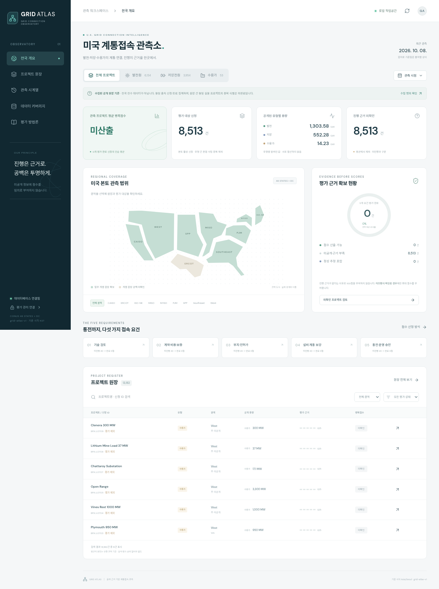

# Grid Atlas · 미국 계통접속 관측소

[](https://github.com/junseo96/usgriddashboard/actions/workflows/grid-atlas-check.yml)

발전원·저장전원·수용가의 계통접속 신청을 모으고, 절차별 진행 근거와 병목점수, 수집 공백, 시점별 이력을 확인하는 대시보드입니다. 애플리케이션은 **[`apps/grid-atlas`](apps/grid-atlas)**에 있습니다.



## 현재 상태

- 새 대시보드, 프로젝트 검색·필터·상세·CSV, 절차별 평가 입력, 관측 이력 구현.
- NYISO 수용가 원장과 LBNL 발전·저장 원장의 수집·검증·적재 구현.
- 원장·참고 자료 13,182건 중 미국 본토 활성 개별 신청 8,513건 집계. 발전·저장 복합 신청은 전체 분모에서 한 번만 집계합니다.
- 실제 요건별 근거 평가는 아직 0건이므로 평균 점수는 **미산출**입니다. 미공개를 미진행 100점으로 간주하지 않습니다.
- Cloudflare 배포와 주간·월간 수집 워크플로 준비. **사이트 공개와 정기 수집은 아직 가동되지 않았습니다.** GitHub에 코드를 저장하는 것과 웹사이트를 운영하는 것은 별도입니다.

전국 수용가의 전수 분모와 수집 공백은 해결되지 않았습니다. 현재 검증된 활성 수용가 신청은 NYISO 53건입니다. LBNL 원자료 기준일은 **2025-12-31**이며, 2026-10-08에 내려받았다고 기준일이 바뀌지 않습니다. 자세한 내용은 [데이터 출처·범위](apps/grid-atlas/docs/DATA.md)를 참고하세요.

## 실행

Node.js **24 이상**, Python **3.12**를 사용합니다. Cloudflare 계정 없이 로컬에서 실행할 수 있습니다.

```sh
git clone https://github.com/junseo96/usgriddashboard.git
cd usgriddashboard/apps/grid-atlas
npm ci
npm run dev
```

최초 실행 때 포함된 공식 자료를 로컬 SQLite에 적재합니다. 이후 실행은 기존 평가와 관측을 보존합니다. 실제 실행 주소는 터미널에 표시됩니다. 로컬 데이터와 비밀값은 Git에 포함하지 않습니다.

```sh
npm run typecheck
npm test
npm run test:python
npm run build
```

## 병목점수

기술 검토, 계약·비용·보증, 부지·인허가, 설비·계통 보강, 통전·운영 승인의 **5개 독립 요건**을 평가합니다.

각 요건의 잔여점수는 `20 × (1 − 진행률)`입니다. 모두 미진행으로 확인되면 100점, 모두 통과하면 0점입니다. 뉴스에 근거한 추정은 원문 URL·적용일·확인시각·판단 이유와 함께 기록합니다. 자동 뉴스 평가 기능은 아직 없습니다.

모든 요건을 평가한 적격 신청의 점수를 동일 가중 평균으로 계산합니다. 미공개는 별도 집계하며, 점수는 지연 기간이나 완공 확률을 뜻하지 않습니다. 원장이 없는 과거 날짜를 현재 자료로 채우지 않습니다.

## 운영·개발 안내

- [앱 구조와 시점 조회 규칙](apps/grid-atlas/README.md)
- [Cloudflare 계정 연결·배포](apps/grid-atlas/docs/DEPLOYMENT.md)
- [주간·월간 갱신과 원문 보존](apps/grid-atlas/docs/OPERATIONS.md)
- [읽기 전용 HTML 내보내기](apps/grid-atlas/docs/PREVIEW.md)
- [초기 구축 검증 기록](apps/grid-atlas/docs/STATUS_2026-10-08.md)

React/Vite 화면과 Worker API, D1 데이터베이스로 구성합니다. 개발 환경에서는 같은 SQL 스키마의 SQLite를 사용합니다. GitHub Pages 같은 정적 호스팅만으로 평가 저장 API와 데이터베이스가 실행되지는 않습니다. 관리자 키는 GitHub Secrets와 배포 환경에만 설정하며 채팅이나 저장소에 넣지 않습니다.

공개 원자료의 권리와 이용 조건은 각 출처를 따릅니다. 이 저장소는 출처별 날짜·링크와 미확보 항목을 함께 보존합니다.
